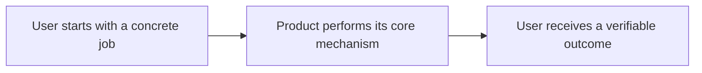

# Product Definition

> Status: initial template. Product decisions belong here; supporting external evidence belongs in
> [`research.md`](research.md).

## Product thesis

What change in the world or user behavior makes this product worth building?

## First user and job

- **First user:**
- **Job to be done:**
- **Current alternative:**

## Positioning

For **[target user]** who needs **[important job]**, **[product]** is a **[category]** that **[primary
outcome]**. Unlike **[main alternative]**, it **[distinctive mechanism or advantage]**.

## Core workflow

## Product objects

| Object | User-facing meaning | Owned data or behavior |
| ------ | ------------------- | ---------------------- |
| TBD    |                     |                        |

## MVP scope

- The smallest end-to-end workflow that proves the product thesis.

## Non-goals

- Capabilities intentionally deferred until the core workflow is validated.

## Differentiation

Which mechanism is difficult to substitute with an existing product, manual workflow, or generic AI
assistant?

## Success signals

- Observable evidence that the first user completed the job better than with the current alternative.

## Open decisions

- Decisions that materially change the user, workflow, architecture, or distribution model.
